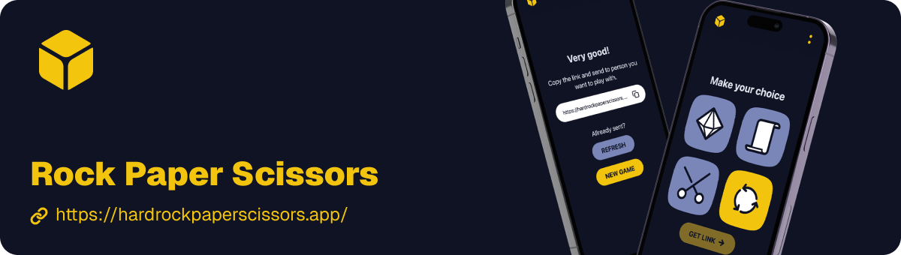

[](https://hardrockpaperscissors.app/)

# Rock Paper Scissors - Jazz Edition

A social Rock Paper Scissors game built with **[Jazz](https://jazz.tools)**, React, TailwindCSS, and Passkey Auth. Create games, challenge friends, and track your game history with real-time collaboration.

## Features

- 🎮 **Create Games**: Make your move and share a link with friends
- 👥 **Multiplayer**: Play with friends in real-time using Jazz's collaborative sync
- 📊 **Game Dashboard**: Track all your games (hosted and guest games) in one place
- 💬 **Optional Comments**: Add questions or comments to your games
- 🔐 **Passkey Auth**: Secure authentication with passkeys
- 📱 **Cross-Device**: Access your games from any device with Jazz Cloud sync
- 🎯 **Game History**: View all plays and results for each game

## Running locally

Install dependencies:

```bash
pnpm install
```

Then, run the development server:

```bash
pnpm dev
```

Open [http://localhost:5173](http://localhost:5173) with your browser to see the result.

## How It Works

1. **Create a Game**: Sign in and create a new game by selecting your move (Rock, Paper, or Scissors)
2. **Share the Link**: Copy and share the game link with your opponent
3. **Play**: Your opponent makes their move and sees the result instantly
4. **Track History**: View all your games in the dashboard, including games you've hosted and games you've played as a guest

## Tech Stack

- **[Jazz](https://jazz.tools)** - Real-time collaborative data sync
- **React 19** - UI framework
- **TanStack Router** - Routing
- **TailwindCSS** - Styling
- **TypeScript** - Type safety
- **Vite** - Build tool

## Project Structure

- `src/schema.ts` - Jazz schema definitions for games, plays, and accounts
- `src/components/` - React components (CreateGame, GamePage, Dashboard, etc.)
- `src/App.tsx` - Main app component with routing
- `src/router.tsx` - Route definitions

## Configuration: Sync Server

By default, the app uses [Jazz Cloud](https://jazz.tools/cloud) (`wss://cloud.jazz.tools`) - so cross-device use, invites and collaboration work automatically.

You can also run a local sync server by running `npx jazz-run sync`, and setting the `sync` parameter of `JazzReactProvider` in [./src/Main.tsx](./src/Main.tsx) to `{ peer: "ws://localhost:4200" }`.
